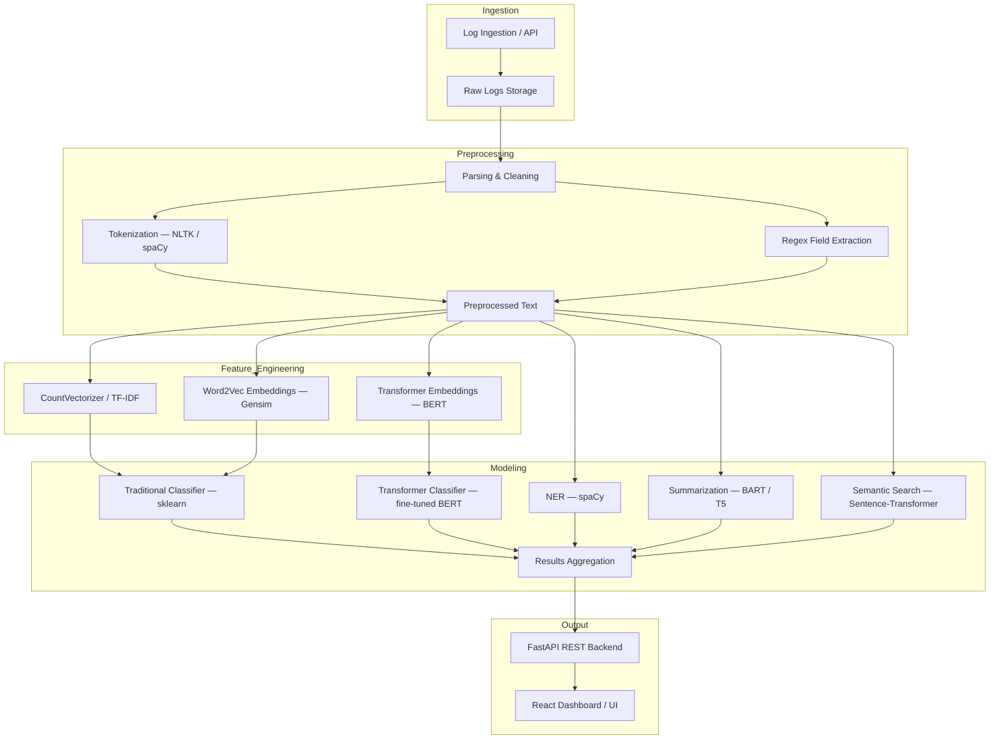

<div align="center">

# 🔍 Argus

### NLP-Based Cybersecurity Log Analysis Platform

[](https://github.com/sushantkumaryadav912/Argus/actions/workflows/codeql.yml)
[](https://github.com/sushantkumaryadav912/Argus/actions/workflows/sonarcloud.yml)

> **Argus** automates the analysis of security logs using NLP and machine learning — classifying threats, extracting entities, summarizing incidents, and recommending remediations in real time.

</div>

---

> [!CAUTION]
> **Proprietary & Confidential**
> This repository and all its contents — including source code, documentation, models, data schemas, architecture designs, and research — are the **exclusive intellectual property of Sushant Kumar Yadav**.
>
> **No part of this project may be used, copied, reproduced, distributed, modified, or built upon — in whole or in part — without the express written permission of the owner and a duly executed contract or license agreement.**
>
> Unauthorized use, access, or distribution is strictly prohibited and may result in legal action.
> For inquiries, contact the repository owner directly.

---

## 📖 Overview

Argus is a comprehensive security operations platform that ingests raw system and network logs and processes them through a multi-stage NLP pipeline to produce:

- **Log Classification** — categorize threats (brute-force, malware, reconnaissance, etc.)
- **Named-Entity Recognition (NER)** — extract IPs, usernames, CVE IDs, file paths
- **Abstractive Summarization** — condense log sequences into human-readable incident reports
- **Semantic Search** — retrieve similar past incidents using dense vector embeddings
- **Remediation Recommendations** — suggest response actions mapped to MITRE ATT&CK tactics

---

## 🏗️ Architecture



---

## ✨ Features

| Module | Description | Libraries |
|---|---|---|
| **Ingestion** | REST API + file upload for JSON, CSV, raw text logs | FastAPI |
| **Preprocessing** | Tokenization, POS tagging, regex field extraction | NLTK, spaCy |
| **Feature Extraction** | TF-IDF, BoW, Word2Vec, Transformer embeddings | scikit-learn, Gensim, Transformers |
| **Classification** | Logistic Regression, Random Forest, fine-tuned BERT | scikit-learn, HuggingFace |
| **NER** | Entity extraction — IPs, users, CVEs, file paths | spaCy |
| **Summarization** | Abstractive incident summaries using BART / T5 | HuggingFace Transformers |
| **Semantic Search** | Dense vector similarity search for incident retrieval | sentence-transformers, FAISS |
| **Remediation** | Rule-based and learned remediation suggestions | Custom + MITRE ATT&CK |

---

## 🗂️ Project Structure

```
Argus/
├── backend/              # FastAPI application
│   └── app/
│       ├── api/          # Route handlers
│       ├── core/         # Configuration, security
│       ├── database/     # DB connections, migrations
│       ├── models/       # ORM models
│       ├── schemas/      # Pydantic schemas
│       ├── services/     # Business logic, NLP pipeline
│       └── utils/        # Shared utilities
├── frontend/             # React + TypeScript + Vite dashboard
├── models/               # Trained ML/NLP model artifacts
├── nlp/                  # NLP pipeline modules
├── transformers/         # Custom transformer training scripts
├── notebooks/            # Jupyter notebooks for experiments
├── data/                 # Raw and processed log datasets
├── tests/                # Unit and integration tests
├── scripts/              # Automation and utility scripts
├── infrastructure/       # Docker, Kubernetes, IaC configs
├── docs/                 # Architecture diagrams, research reports
└── docker-compose.yml    # Local development stack
```

---

## 🛠️ Tech Stack

| Layer | Technology |
|---|---|
| **Language** | Python 3.10+, TypeScript |
| **Backend** | FastAPI |
| **Frontend** | React, Vite, TypeScript |
| **NLP / ML** | NLTK, spaCy, scikit-learn, Gensim, HuggingFace Transformers (PyTorch) |
| **Semantic Search** | sentence-transformers, FAISS |
| **Database** | PostgreSQL |
| **Containerization** | Docker, Docker Compose |
| **CI / CD** | GitHub Actions |
| **Code Quality** | CodeQL, SonarCloud |

---

## 📊 Supported Datasets

| Dataset | Domain | Size | Format |
|---|---|---|---|
| HDFS | Big Data Systems | ~11M lines (1.47 GiB) | Text |
| Blue Gene/L (BGL) | HPC Systems | ~4.7M lines (708 MB) | Text |
| Windows Event Logs | OS Security | ~114M lines (26 GB) | Text / CSV |
| Linux Syslog | OS / Applications | ~2.3M lines | Text |
| AWS CloudTrail | Cloud Audit | ~1.94M events | JSON |
| Custom / Synthetic | All domains | Variable | Various |

---

## ⚙️ Getting Started

### Prerequisites

- Python 3.10+
- Node.js 18+
- Docker & Docker Compose
- PostgreSQL

### Installation

```bash
# Clone the repository
git clone https://github.com/sushantkumaryadav912/Argus.git
cd Argus

# Install Python dependencies
pip install -r requirements.txt

# Install frontend dependencies
cd frontend && npm install
```

### Running Locally

```bash
# Start all services via Docker Compose
docker compose up

# Or run individually:

# Backend
cd backend && uvicorn app.main:app --reload

# Frontend
cd frontend && npm run dev
```

---

## 🔒 Security & Privacy

- All logs containing PII (IP addresses, usernames) are **anonymized** before public use
- Argus does **not** send data to external third-party LLM APIs
- The system is designed for **defensive security** use only
- Compliant with GDPR principles for data handling

---

## 📄 License & Legal

**All Rights Reserved © Sushant Kumar Yadav**

This software is **not open source**. The source code is made publicly visible for portfolio and review purposes only. **No license is granted** to use, copy, modify, merge, publish, distribute, sublicense, or sell copies of this software or any part of it without a signed written agreement with the owner.

Any use of this codebase — including forking, cloning for commercial or academic purposes, or incorporating any portion into another project — requires prior written consent and a formal contract.

---

## 📬 Contact

For licensing, collaboration, or usage inquiries, please reach out to the repository owner via GitHub.

---

<div align="center">
  <sub>Built with ❤️ by <a href="https://github.com/sushantkumaryadav912">Sushant Kumar Yadav</a></sub>
</div>
