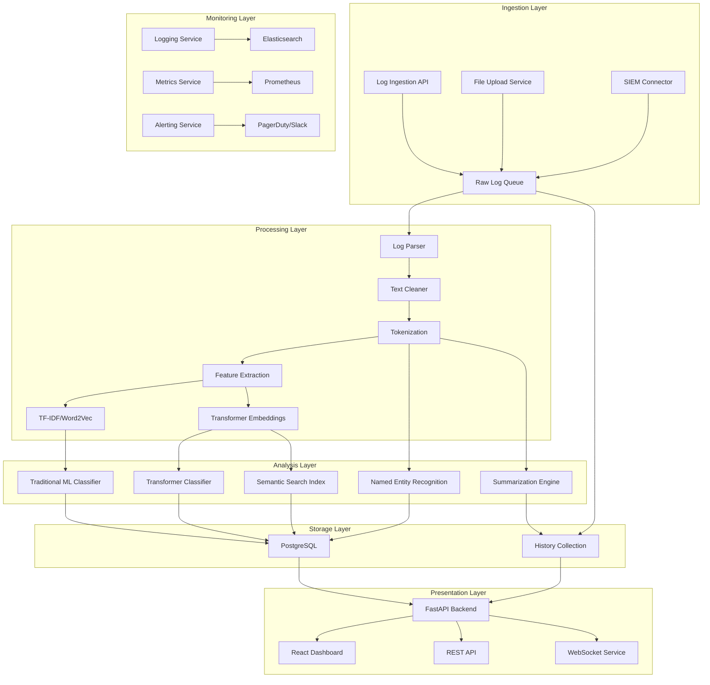

# 🔍 Argus

<div align="center">

### Next-Generation AI-Powered Cybersecurity Operations Platform

[](https://github.com/sushantkumaryadav912/Argus/actions/workflows/codeql.yml)
[](https://github.com/sushantkumaryadav912/Argus/actions/workflows/sonarcloud.yml)

> **Argus** is a production-grade security operations platform that leverages advanced NLP, machine learning, and dual-database architecture to provide real-time threat detection, incident analysis, and automated response capabilities for modern SOC teams.

</div>

---

> [!CAUTION]
> **Proprietary & Confidential**
> This repository and all its contents — including source code, documentation, models, data schemas, architecture designs, and research — are the **exclusive intellectual property of Sushant Kumar Yadav**.
> 
> **No part of this project may be used, copied, reproduced, distributed, modified, or built upon — in whole or in part — without the express written permission of the owner and a duly executed contract or license agreement.**
> 
> Unauthorized use, access, or distribution is strictly prohibited and may result in legal action.
> For inquiries, contact the repository owner directly.

---

## 📖 Overview

Argus is a comprehensive **Security Operations Center (SOC) automation platform** that transforms raw security logs into actionable intelligence through a sophisticated multi-stage AI pipeline. Built for enterprise-scale deployment, Argus combines:

- **Real-time threat classification** using hybrid ML models
- **Advanced entity extraction** with spaCy NER and custom regex patterns
- **Semantic search capabilities** for incident correlation
- **Automated remediation recommendations** mapped to MITRE ATT&CK framework
- **Dual-database architecture** (PostgreSQL + MongoDB) for optimal performance
- **Modern React dashboard** with glassmorphism UI for security analysts

The platform is designed to **reduce mean time to detection (MTTD) and mean time to response (MTTR)** by automating repetitive analysis tasks while providing security teams with intuitive tools for investigation and response.

---

## 🏗️ Architecture



---

## ✨ Key Features

### 🔍 Threat Detection & Classification
- **Hybrid classification pipeline** combining traditional ML (Logistic Regression, Random Forest) with fine-tuned transformer models (BERT)
- **Multi-label threat categorization** supporting 12+ MITRE ATT&CK techniques
- **Confidence scoring** with adjustable thresholds for false positive reduction
- **Model ensemble** with weighted voting for improved accuracy

### 🧠 Named Entity Recognition
- **Custom spaCy NER pipeline** trained on security log data
- **Regex-based entity extraction** for IPs, domains, file paths, and CVEs
- **Context-aware entity resolution** to handle ambiguous references
- **Entity linking** to MITRE ATT&CK techniques and CVE databases

### 📊 Semantic Search & Incident Correlation
- **Dense vector embeddings** using sentence-transformers
- **FAISS-based similarity search** for efficient incident retrieval
- **Temporal correlation** of related events across time windows
- **Graph-based relationship visualization** of connected entities

### 🤖 Automated Response & Remediation
- **Rule-based remediation suggestions** mapped to MITRE ATT&CK tactics
- **Playbook integration** for automated response workflows
- **Risk scoring** for prioritization of critical incidents
- **Ticketing system integration** (Jira, ServiceNow)

### 🖥️ Modern Security Operations Dashboard
- **Glassmorphism UI** with dark/light mode support
- **Real-time notifications** with severity-based alerts
- **Interactive data visualization** with time-series charts
- **Customizable widgets** for SOC team preferences
- **Responsive design** for desktop and mobile access

### 🗃️ Dual-Database Architecture
- **PostgreSQL** for structured data (logs, classifications, entities)
- **MongoDB** for unstructured data (notifications, alerts, history)
- **Optimized queries** for high-throughput security operations
- **Automatic failover** and connection resilience

---

## 🗂️ Detailed Project Structure

```
Argus/
├── .github/                     # GitHub Actions workflows
│   ├── workflows/
│   │   ├── codeql.yml           # CodeQL security scanning
│   │   ├── sonarcloud.yml       # SonarCloud code quality
│   │   └── tests.yml           # Automated test suite
│   └── ISSUE_TEMPLATE/         # GitHub issue templates
│
├── backend/                    # FastAPI backend application
│   ├── app/
│   │   ├── api/                # API route handlers
│   │   │   ├── __init__.py
│   │   │   ├── analysis.py     # NLP analysis endpoints
│   │   │   ├── dashboard.py    # Dashboard statistics
│   │   │   ├── health.py       # Health check endpoints
│   │   │   ├── logs.py         # Log ingestion endpoints
│   │   │   ├── notifications.py # Notification endpoints
│   │   │   └── settings.py     # System settings endpoints
│   │   │
│   │   ├── core/              # Core application components
│   │   │   ├── __init__.py
│   │   │   ├── config.py      # Application configuration
│   │   │   ├── deps.py        # Dependency injection
│   │   │   ├── logging.py     # Structured logging setup
│   │   │   ├── model_registry.py # ML model loading/management
│   │   │   └── security.py    # Authentication/security
│   │   │
│   │   ├── database/         # Database connections
│   │   │   ├── __init__.py
│   │   │   ├── init_db.py    # Database initialization
│   │   │   ├── mongo.py      # MongoDB connection manager
│   │   │   ├── postgres.py   # PostgreSQL connection manager
│   │   │   └── seed.py       # Database seeding
│   │   │
│   │   ├── models/           # ORM models (SQLAlchemy)
│   │   │   ├── __init__.py
│   │   │   ├── analysis.py   # Analysis result models
│   │   │   ├── dashboard.py  # Dashboard metric models
│   │   │   ├── entity.py     # Extracted entity models
│   │   │   ├── log.py        # Log entry models
│   │   │   ├── notification.py # Notification models
│   │   │   └── settings.py   # System settings models
│   │   │
│   │   ├── schemas/         # Pydantic request/response schemas
│   │   │   ├── __init__.py
│   │   │   ├── analysis.py   # Analysis request/response
│   │   │   ├── dashboard.py  # Dashboard statistics
│   │   │   ├── entity.py     # Entity extraction schemas
│   │   │   ├── log.py        # Log ingestion schemas
│   │   │   ├── notification.py # Notification schemas
│   │   │   └── settings.py   # Settings schemas
│   │   │
│   │   ├── services/        # Business logic services
│   │   │   ├── __init__.py
│   │   │   ├── analysis_service.py # NLP analysis pipeline
│   │   │   ├── dashboard_service.py # Dashboard metrics
│   │   │   ├── notification_service.py # Notification management
│   │   │   ├── semantic_service.py # Semantic search
│   │   │   └── settings_service.py # System settings
│   │   │
│   │   └── main.py         # FastAPI application entry point
│   │
│   ├── .env.example        # Environment variable template
│   ├── requirements.txt     # Python dependencies
│   └── tests/              # Backend unit tests
│
├── data/                     # Data storage and processing
│   ├── datasets/             # Raw security log datasets
│   ├── processed/            # Processed/cleaned datasets
│   ├── raw/                  # Original raw log files
│   └── uploads/              # User-uploaded log files
│
├── docs/                     # Documentation and research
│   ├── api/                  # API documentation
│   ├── architecture/         # Architecture diagrams
│   ├── diagrams/             # System diagrams
│   ├── legal/                # Legal documents
│   ├── report/               # Research reports
│   └── research/             # NLP/ML research notes
│
├── frontend/                 # React + TypeScript dashboard
│   ├── dist/                 # Production build output
│   ├── node_modules/         # Node.js dependencies
│   ├── public/               # Static assets
│   ├── src/
│   │   ├── assets/           # Static resources
│   │   ├── components/       # Reusable UI components
│   │   │   ├── GlassCard.tsx # Glassmorphism card component
│   │   │   ├── SeverityBadge.tsx # Severity indicator
│   │   │   └── ...
│   │   ├── pages/            # Application pages
│   │   │   ├── Analysis.tsx   # Log analysis interface
│   │   │   ├── Dashboard.tsx  # Main dashboard
│   │   │   ├── Logs.tsx       # Log viewer
│   │   │   ├── Notifications.tsx # Notification center
│   │   │   └── Settings.tsx   # System settings
│   │   ├── services/         # API service clients
│   │   │   └── api.ts        # API client configuration
│   │   ├── types/            # TypeScript type definitions
│   │   ├── App.tsx           # Main application component
│   │   ├── index.html        # HTML template
│   │   ├── main.tsx          # Application entry point
│   │   └── vite-env.d.ts     # Vite environment types
│   │
│   ├── package.json         # Frontend dependencies
│   ├── tsconfig.json        # TypeScript configuration
│   └── vite.config.ts       # Vite build configuration
│
├── nlp/                      # Natural Language Processing pipeline
│   ├── classification/       # Log classification models
│   │   ├── dataset.py        # Dataset preparation
│   │   ├── evaluate.py       # Model evaluation
│   │   ├── predict.py        # Prediction interface
│   │   └── train.py         # Model training
│   │
│   ├── embeddings/          # Text embedding models
│   │   └── word2vec.py      # Word2Vec implementation
│   │
│   ├── feature_extraction/  # Feature engineering
│   │   ├── count_vectorizer.py # Bag-of-Words
│   │   └── tfidf.py         # TF-IDF implementation
│   │
│   ├── ner/                 # Named Entity Recognition
│   │   └── extract_entities.py # Entity extraction
│   │
│   ├── preprocessing/      # Text preprocessing
│   │   ├── cleaner.py       # Text cleaning
│   │   ├── lemmatizer.py    # Text lemmatization
│   │   ├── stopwords.py     # Stopword management
│   │   └── tokenizer.py     # Text tokenization
│   │
│   ├── summarization/      # Log summarization
│   │   └── summarizer.py    # Abstractive summarization
│   │
│   └── translation/        # Log translation
│       └── translator.py   # Multi-language support
│
├── scripts/                  # Utility scripts
│   ├── data_processing/      # Data processing scripts
│   ├── deployment/           # Deployment scripts
│   └── monitoring/           # Monitoring scripts
│
├── tests/                    # Test suite
│   ├── backend/              # Backend API tests
│   └── nlp/                  # NLP pipeline tests
│
├── docker-compose.yml        # Local development stack
├── Dockerfile                # Backend Dockerfile
├── Dockerfile.frontend       # Frontend Dockerfile
├── LICENSE                   # Legal license
└── README.md                 # Project documentation
```

### 📁 Detailed Module Breakdown

#### **Backend (`/backend`)**
- **API Layer**: RESTful endpoints for log ingestion, analysis, search, and system management
- **Core**: Application configuration, dependency injection, logging, and security
- **Database**: Connection management for PostgreSQL and MongoDB with automatic failover
- **Models**: SQLAlchemy ORM models for structured data storage
- **Schemas**: Pydantic validation schemas for request/response data
- **Services**: Business logic layer implementing the NLP pipeline and system functionality

#### **Frontend (`/frontend`)**
- **Modern React Dashboard**: Glassmorphism UI with responsive design for security analysts
- **Component Library**: Reusable UI components with consistent styling
- **Page Components**: Dedicated interfaces for analysis, logs, notifications, and settings
- **API Services**: TypeScript clients for backend API integration

#### **NLP Pipeline (`/nlp`)**
- **Preprocessing**: Text cleaning, tokenization, lemmatization, and stopword removal
- **Feature Extraction**: TF-IDF, Bag-of-Words, and Word2Vec embeddings
- **Classification**: Hybrid ML models for threat categorization
- **NER**: Named entity recognition for security-relevant entities
- **Summarization**: Abstractive summarization of security incidents
- **Translation**: Multi-language support for international SOC teams

#### **Data (`/data`)**
- **Datasets**: Raw and processed security log datasets for model training
- **Uploads**: Temporary storage for user-uploaded log files

#### **Documentation (`/docs`)**
- **Architecture**: System architecture diagrams and design documents
- **API**: API reference documentation
- **Research**: NLP/ML research notes and experiment results

---

## 🛠️ Tech Stack

| Layer               | Technology Stack                                                                                     |
|---------------------|------------------------------------------------------------------------------------------------------|
| **Backend**         | FastAPI, Python 3.10+, Pydantic, SQLAlchemy, Asyncpg, Motor                                         |
| **Frontend**        | React 18+, TypeScript, Vite, Tailwind CSS, Lucide Icons, Glassmorphism UI                            |
| **Databases**       | PostgreSQL (structured data), MongoDB (unstructured data)                                           |
| **NLP/ML**          | spaCy, NLTK, scikit-learn, Gensim, HuggingFace Transformers (PyTorch), sentence-transformers, FAISS |
| **DevOps**          | Docker, Docker Compose, GitHub Actions, CodeQL, SonarCloud                                          |
| **Monitoring**      | Structured Logging, Prometheus (planned), Elasticsearch (planned)                                   |
| **Authentication**  | JWT (planned), OAuth2 (planned)                                                                     |

---

## 📊 Supported Security Log Formats

Argus supports a wide variety of security log formats out of the box:

| Log Type               | Format       | Example Sources                          |
|-----------------------|--------------|------------------------------------------|
| System Logs           | Text, JSON   | Linux syslog, Windows Event Logs         |
| Network Logs          | Text, CSV    | Firewalls, IDS/IPS, VPN                  |
| Cloud Logs            | JSON         | AWS CloudTrail, Azure Monitor, GCP Audit |
| Application Logs      | Text, JSON   | Web servers, databases, custom apps       |
| Endpoint Logs         | JSON         | EDR/XDR solutions, antivirus             |
| Authentication Logs   | Text, CSV    | Active Directory, LDAP, SSO              |
| Custom Security Logs  | Any          | SIEM exports, custom security tools       |

---

## ⚙️ Getting Started

### Prerequisites

- **Backend**: Python 3.10+, PostgreSQL 13+, MongoDB 5+
- **Frontend**: Node.js 18+, npm 9+
- **Containerized**: Docker, Docker Compose

### Installation

```bash
# Clone the repository
git clone https://github.com/sushantkumaryadav912/Argus.git
cd Argus

# Set up environment variables
cp backend/.env.example backend/.env
# Edit backend/.env with your configuration

# Install backend dependencies
cd backend
pip install -r requirements.txt

# Install frontend dependencies
cd ../frontend
npm install
```

### Running the Platform

#### Option 1: Docker Compose (Recommended)

```bash
# Start all services
docker compose up --build

# Access the dashboard at http://localhost:3000
# API documentation at http://localhost:8000/api/docs
```

#### Option 2: Manual Execution

```bash
# Start backend
cd backend
uvicorn app.main:app --reload

# Start frontend
cd ../frontend
npm run dev
```

---

## 🔐 Security & Privacy

Argus is designed with security and privacy as core principles:

- **Data Isolation**: All processing occurs within your infrastructure - no external API calls
- **Anonymization**: Automatic PII redaction before storage and analysis
- **Encryption**: TLS for all communications, encryption at rest for sensitive data
- **Access Control**: Role-based access control (planned) for multi-user environments
- **Audit Logging**: Comprehensive audit trails for all security-relevant actions
- **GDPR Compliance**: Designed to support GDPR and other privacy regulations

---

## 📈 Performance Characteristics

| Component               | Performance Metric                     | Notes                                      |
|-------------------------|----------------------------------------|--------------------------------------------|
| Log Ingestion           | 10,000+ logs/second                    | With batch processing                      |
| Classification          | <500ms per log                         | With GPU acceleration                      |
| Entity Extraction       | <200ms per log                         | spaCy NER pipeline                         |
| Semantic Search         | <100ms for 1M+ log corpus              | FAISS-optimized vector search              |
| Dashboard Rendering     | <1s page load                          | With code splitting and lazy loading       |
| Model Memory Usage      | ~2GB for all models                    | With quantization and model optimization   |

---

## 🚀 Roadmap

### Near-Term (v2.1)
- [ ] WebSocket support for real-time updates
- [ ] Role-based access control
- [ ] Integration with SIEM platforms (Splunk, QRadar)
- [ ] Automated playbook execution
- [ ] Enhanced model explainability

### Mid-Term (v2.5)
- [ ] Federated learning for model improvements
- [ ] Multi-language support for global SOCs
- [ ] Advanced correlation rules engine
- [ ] Threat intelligence feed integration
- [ ] Automated report generation

### Long-Term (v3.0)
- [ ] Autonomous SOC capabilities
- [ ] Predictive threat modeling
- [ ] Self-healing infrastructure integration
- [ ] Quantum-resistant encryption
- [ ] AI-powered analyst assistant

---

## 📄 License & Legal

**All Rights Reserved © Sushant Kumar Yadav**

This software is **proprietary and confidential**. The source code is made publicly visible for **portfolio and review purposes only**. **No license is granted** for any use, modification, or distribution without explicit written permission.

For licensing inquiries, collaboration opportunities, or commercial use, please contact the repository owner directly.

---

<div align="center">
  <sub>Built with ❤️ by <a href="https://github.com/sushantkumaryadav912">Sushant Kumar Yadav</a> | Next-Generation Cybersecurity Operations</sub>
</div>