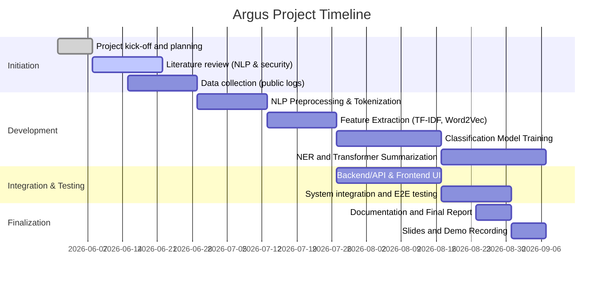

# Argus: NLP-Based Cybersecurity Log Analysis Platform

## Executive Summary  
**Argus** is a unified cybersecurity log analysis platform leveraging natural language processing (NLP) to transform raw system and network logs into actionable insights.  Its **MVP** pipeline ingests log data, performs NLP preprocessing (tokenization, lemmatization), extracts text features (bag-of-words, TF-IDF, Word2Vec), and applies machine learning for log classification and anomaly detection.  Advanced components include entity extraction (NER) from logs and summarization of incidents using transformer models (e.g. BERT/BART).  Optional extensions include intent/sentiment analysis and log translation (seq2seq) for multilingual environments.  The architecture is modular and cloud-ready, featuring a web dashboard for real-time visualization of results. 

Key features covered align with the NLP syllabus: NLTK and spaCy preprocessing, CountVectorizer/TF-IDF feature extraction, Gensim Word2Vec embeddings, text classification models (traditional ML and transformer-based), named-entity recognition, and optional seq2seq translation.  For example, scikit-learn’s `TfidfVectorizer` is used to convert log text into TF-IDF vectors, and Gensim’s `Word2Vec` implements skip-gram/CBOW for word embeddings.  An executive timeline and deliverables (report, code, demo video, slides) are planned for end-of-semester submission.  Evaluation will use standard metrics (accuracy, F1 for classification; ROUGE for summarization).  Risk mitigation includes starting with small models (DistilBERT) if GPU is limited, and using public log datasets (HDFS, BGL, AWS CloudTrail) to bootstrap data needs. 

## Project Overview and Objectives  
Argus aims to provide **automated analysis of cybersecurity logs** by treating log messages as textual data.  In practice, an operator will upload or stream logs to Argus, which will:

- **Preprocess** the text (tokenize, remove noise, lemmatize) using NLTK and spaCy.  
- **Vectorize** the text into numerical features (bag-of-words and TF-IDF, and Word2Vec embeddings).  
- **Classify logs** into categories (e.g. normal vs anomalous, or types of incidents) with ML classifiers (Naive Bayes, SVM, Random Forest) and optionally fine-tuned BERT for accuracy.  
- **Extract entities** (IP addresses, error codes, usernames) using NER (spaCy or transformers) so the operator can filter by e.g. “host” or “user”. For example, given “Connection refused from 192.168.1.10 on host server-01”, the NER component can automatically extract the IP, error message, host name, and timestamp.  
- **Summarize incidents** using a transformer model (e.g. fine-tuned BART or T5) so that long log streams become concise summaries (using extractive/abstractive summarization).  

The main objectives are:
- Implement all core NLP techniques from the syllabus (tokenization, stop words removal, lemmatization, TF-IDF, Word2Vec, classifiers, Transformers, pipeline design).  
- Deliver a working MVP by semester’s end: a cohesive system with a web interface demonstrating log upload, processing, and output.  
- Design optional extensions (sentiment/intent analysis, multilingual translation) that can be added if time permits.  
- Provide documentation and evaluation to demonstrate each requirement is met, aligned with course outcomes.

## Scope: MVP vs Optional Extensions  
- **MVP (Semester Goal)**: Log ingestion, preprocessing (NLTK/spaCy), feature extraction (CountVectorizer, TF-IDF, Word2Vec), a text-classification model for anomaly detection or log-type classification, basic named-entity extraction, and summarization (e.g. using a pretrained BART or fine-tuned BERT).  A simple web UI (React + Chart.js) will display metrics and examples.  All core NLP course topics (listed below) are covered in the MVP.  
- **Optional Extensions**: If time allows, add a sentiment/intent analysis module (e.g. using a transformer classifier to detect log severity or user intent), a seq2seq translation feature (e.g. using MarianMT via Hugging Face to translate logs into another language), and enhanced dashboard analytics. These extend the “NLP pipeline” and “real-world application” aspects without altering the core delivery.

## System Architecture

 *Figure: Conceptual Argus system architecture (log ingestion to NLP analysis to insights).*

The architecture follows a modular pipeline. Logs flow from left to right: ingestion → preprocessing → feature extraction → analysis → presentation. The Mermaid diagram below summarises this flow:

```mermaid
flowchart LR
    subgraph Ingestion
      A[Log Upload/API] --> B[Log Storage]
    end
    subgraph Preprocessing
      B --> C{Tokenization}
      C --> D[Lemmatization]
      C --> E[Stopword Removal]
      D --> F[Processed Tokens]
      E --> F
    end
    subgraph Feature_Extraction
      F --> G[CountVectorizer/TF-IDF]
      F --> H[Word2Vec Embedding]
    end
    subgraph Analysis
      G --> I[Classifier (ML)]
      H --> I
      F --> J[Named Entity Recognition]
      G --> K[Transformer Summarization]
    end
    subgraph Presentation
      I --> L[Results Database]
      J --> L
      K --> L
      L --> M[Web Dashboard / API Endpoints]
    end
```

- **Log Ingestion**: REST API (FastAPI) or file upload that ingests raw log text into storage (database or flat files).  
- **Preprocessing**: Tokenize each log entry (e.g. with `nltk.word_tokenize()` or spaCy), convert to lowercase, remove punctuation/stopwords, and lemmatize (using spaCy’s `nlp(text).lemma_`). SpaCy provides “linguistically-motivated tokenization” and built-in NER/POS tools.  
- **Feature Extraction**: 
  - Use **CountVectorizer** (scikit-learn) to build a term-frequency (bag-of-words) matrix, and **TfidfVectorizer** for TF-IDF weights.  These transform text into numeric features for ML.  
  - Use **Gensim Word2Vec** to train word embeddings on the log corpus, capturing semantic similarity.  For example, the trained model allows queries like `model.wv.most_similar('error')` to find related terms. This helps in finding similar logs or clustering.  
- **Analysis**:  
  - **Classification/Anomaly Detection**: Apply machine learning (e.g. logistic regression, SVM, random forest from scikit-learn) to predict log categories (normal vs anomaly, or specific event types).  The feature vector may combine TF-IDF and other numeric features.  Evaluation will use precision, recall, F1 on a labeled test set.  
  - **Named-Entity Recognition (NER)**: Use spaCy (or fine-tuned transformer) to identify key fields in logs (IPs, user names, file paths). For instance, NER on the sample log `"Connection refused from 192.168.1.10 by user admin"` would extract IP `192.168.1.10`, error type, and user name.  
  - **Summarization**: Use a transformer model (e.g. Hugging Face’s `facebook/bart-large-cnn`) to generate a brief summary of verbose logs. Summarization here means producing a shorter text capturing the gist. The pipeline may combine logs by time window and summarize them.  
- **Presentation**: Processed results (class labels, entities, summaries) are stored and exposed via an API or directly to the frontend. A React-based dashboard visualizes alerts, counts, and summaries (e.g. charts of anomaly rates, word clouds, etc.).  

## Implementation Plan by Module  

1. **Data Preprocessing Module**:  
   - **Tasks**: Read logs line-by-line; use NLTK (`word_tokenize`) and/or spaCy for tokenization and sentence splitting.  Remove irrelevant tokens (IP obfuscation optional) and stop words. Lemmatize words to their base forms (e.g. “failed” → “fail”) to reduce vocabulary size.  
   - **Tools**: `nltk.word_tokenize()`, `spacy.load("en_core_web_sm")`.  
   - **Sample Code**:  
     ```python
     import nltk, spacy
     nlp = spacy.load("en_core_web_sm")
     tokens = nltk.word_tokenize(log_entry)
     tokens = [w for w in tokens if w.isalnum()]
     lemmas = [token.lemma_ for token in nlp(" ".join(tokens))]
     ```
   - **Syllabus Link**: Covers tokenization, regex (if cleaning), and morphological normalization.  

2. **Feature Extraction Module**:  
   - **Bag-of-Words/TF-IDF**: Use `CountVectorizer` and `TfidfVectorizer` from scikit-learn.  These convert tokens to numeric vectors (token counts or TF-IDF weights).  Experiment with n-grams (uni/bi-grams) and term frequency thresholds (`min_df`).  
     ```python
     from sklearn.feature_extraction.text import CountVectorizer, TfidfVectorizer
     tfidf = TfidfVectorizer(min_df=2, ngram_range=(1,2))
     X_tfidf = tfidf.fit_transform(preprocessed_logs)
     ```  
   - **Word2Vec Embeddings**: Train a Gensim Word2Vec model on the tokenized logs. This yields vector representations capturing word semantics.  The model can help find similar log messages or cluster by meaning. For speed, use a small vector size (e.g. 50) and the hierarchical softmax.  
     ```python
     from gensim.models import Word2Vec
     model = Word2Vec(sentences=tokenized_logs, vector_size=50, window=5, min_count=2)
     similar = model.wv.most_similar("error", topn=5)  # nearest words
     ```  
   - **Module Output**: For each log, produce a feature vector (e.g. concatenated TF-IDF + average Word2Vec) to feed into classifiers.  
   - **Syllabus Link**: Covers vectorization (Count, TF-IDF) and embedding techniques (Word2Vec).  

3. **Text Classification Module**:  
   - **Task**: Train supervised models on labeled logs (or anomalies).  Possible labels: log severity (INFO/WARN/ERROR), or event types (login, file-transfer, etc.), or binary anomaly vs normal.  
   - **Approach**: Split data into train/test. Use scikit-learn classifiers (Naive Bayes, SVM, Random Forest) on the feature vectors from above. Evaluate with cross-validation. Optionally fine-tune a pre-trained transformer (BERT) on the same labels for improved accuracy.  For example, `transformers` library can fine-tune `bert-base-uncased` for sequence classification.  
   - **Performance Metrics**: Use accuracy, precision, recall, F1-score (e.g. via `sklearn.metrics.classification_report`). Ensure at least moderate scores on test data.  
   - **Library Support**: Scikit-learn for classical ML; Hugging Face for BERT. Example snippet for pipeline classification:  
     ```python
     from sklearn.ensemble import RandomForestClassifier
     clf = RandomForestClassifier(n_estimators=100)
     clf.fit(X_train, y_train)
     print(classification_report(y_test, clf.predict(X_test)))
     ```  
   - **Syllabus Link**: Text classification models and evaluation (accuracy/F1).  (Optional: sentiment analysis as “intent” classification on log text).  

4. **Named Entity Recognition (NER) Module**:  
   - **Task**: Identify and label entities in log text (IP addresses, hostnames, usernames, file paths, error codes).  
   - **Approach**: Use spaCy’s built-in NER (with custom extensions) or a fine-tuned transformer model for NER. For example, spaCy can be trained to recognize patterns like IPs using `EntityRuler`. A transformer like `dslim/bert-base-NER` can be used off-the-shelf.  
   - **Example**: For log *“User alice failed login from 10.0.0.5 on server-01”*, NER can mark `alice` (USER), `10.0.0.5` (IP), `server-01` (HOST).  This structured output helps filter or search logs by entity.  
   - **Code Snippet**:  
     ```python
     import spacy
     nlp = spacy.load("en_core_web_sm")
     doc = nlp("Login failed for user alice from 10.0.0.5")
     for ent in doc.ents:
         print(ent.text, ent.label_)
     ```  
   - **Syllabus Link**: NER concept (often covered in advanced NLP courses).  

5. **Transformer Modules (BERT/Summarization)**:  
   - **BERT for Classification/Semantics**: Use Hugging Face Transformers for tasks. For classification, load `bert-base-uncased` and fine-tune on the log categories.  For similarity search, encode logs via BERT embeddings (using sentence transformers) and do nearest-neighbor retrieval. As noted in reference, contextual models like BERT capture semantics of log messages.  
   - **Summarization**: Utilize a pretrained abstractive model (e.g. Facebook’s BART large fine-tuned on CNN/DailyMail) to summarize concatenated logs. Hugging Face’s `pipeline("summarization")` can be used. Hugging Face docs note summarization can be extractive or abstractive.  e.g.:  
     ```python
     from transformers import pipeline
     summarizer = pipeline("summarization", model="facebook/bart-large-cnn")
     summary = summarizer(long_log_text, max_length=60)[0]['summary_text']
     ```  
   - **Text Translation (Seq2Seq)** *(Optional)*: If multilingual support is desired, use MarianMT or other sequence-to-sequence models to translate log messages into another language (e.g. English↔Hindi). This is advanced/optional and follows typical seq2seq translation pipelines.  
   - **Syllabus Link**: Covers Transformers (BERT, seq2seq models), illustrating modern NLP pipeline components.

6. **System/API Layer and Dashboard**:  
   - **Backend (FastAPI)**: REST endpoints for uploading logs, triggering analysis, and retrieving results.  Example endpoints:  
     - `POST /api/logs/upload` (upload log file or raw text)  
     - `GET /api/logs/entities?entity=IP` (filter logs by extracted entities)  
     - `POST /api/analyze/classify` (return classification label for new log)  
     - `POST /api/analyze/summarize` (return summary of provided logs)  
   - **Frontend (React + Chart.js)**: Visualise output (pie charts of log categories, tables of extracted entities, text area for summaries). Or a lightweight alternative like Streamlit can be used for simplicity.  
   - **Data Storage**: SQLite or PostgreSQL to store processed logs and results.  

## Datasets and Sample Formats  
Use public log datasets as training/test data. Examples include: 
- **HDFS Log Dataset (Anomaly Detection)** – a standard dataset of Hadoop distributed file system logs (Kaggle LogHub). Format: each line is a log event. *Pros*: well-known, includes labeled anomalies. *Cons*: domain-specific Hadoop jobs. 
- **BlueGene/L (BGL) Supercomputer Logs** – logs from LLNL supercomputer. *Pros*: large-scale HPC logs, anomaly labels available. *Cons*: HPC-specific events. 
- **AWS CloudTrail Logs** – JSON-formatted AWS event logs (create/stop EC2, IAM changes). *Pros*: Real-world cloud security events. *Cons*: JSON schema parsing needed. 
- **Typical Syslogs/Application Logs** – e.g. Apache access logs, Windows Event logs. *Pros*: easily available, diverse events. *Cons*: inconsistent format, may need regex parsing. 

Each dataset’s format: mostly plaintext or JSON.  For example, a CloudTrail log record (JSON) contains fields like `eventName`, `userIdentity.userName`, and `sourceIPAddress`.  Apache logs are line-based (e.g. `"192.168.1.5 - - [date] \"GET /index.html HTTP/1.1\" 200 1024"`).  Datasets can be split into train/test; a small sample (100–1000 lines) can be manually labeled to bootstrap models.  

| Dataset          | Format         | Pros                           | Cons                         |
|------------------|----------------|--------------------------------|------------------------------|
| HDFS logs        | Plain text     | Well-known anomaly dataset; labeled failures | Specific to Hadoop domain   |
| BGL supercomputer | Plain text    | Large, public log collection; anomaly labels available | HPC-specific events         |
| AWS CloudTrail   | JSON logs      | Real cloud events; structured fields    | Requires JSON parsing       |
| Syslogs (Linux)  | Plain text     | Common server logs; simple format | Varies by system, manual parsing needed |
| Windows Events   | XML/JSON logs  | Windows audit/security events  | Requires Windows or conversion tool   |

## Evaluation Metrics and Test Plan  
- **Classification Metrics**: For any log classifier, report accuracy, precision, recall, and F1-score on a held-out test set. Use scikit-learn’s `classification_report` and confusion matrix.  
- **NER Metrics**: Measure precision/recall of entity extraction (e.g. percentage of IPs correctly identified).  
- **Summarization Metrics**: Use ROUGE scores (ROUGE-1, ROUGE-2) to compare generated summaries against reference summaries (if available), as is standard for text summarization.  
- **Testing**: 
  - Unit test each component (e.g. tokenization gives expected tokens). 
  - Integration test: end-to-end with sample log files. 
  - Demo test plan: load synthetic or real logs, verify UI outputs sensible labels and summaries. 
- **Acceptance Criteria**: At least 70–80% F1 on classification (for a baseline dataset), and summary outputs that capture key events.  

## Technology Stack and Alternatives  

| Component            | Primary Choice          | Lightweight Alternative       |
|----------------------|-------------------------|-------------------------------|
| **Programming**      | Python 3.10+           | Python 3.8 (compatibility)    |
| **Backend API**      | FastAPI (Python)| Flask or SimpleHTTP server    |
| **Frontend**         | React + Chart.js      | Streamlit or simple HTML/JS   |
| **Database**         | PostgreSQL           | SQLite (local) or JSON files  |
| **NLP - Tokenization** | NLTK, spaCy   | Just one (e.g. spaCy only)    |
| **NLP - Vectorization** | scikit-learn `TfidfVectorizer`, `CountVectorizer` | Manual TF-IDF code or simpler `CountVectorizer` only |
| **Embeddings**       | Gensim Word2Vec  | Pretrained GloVe (spacy vectors) |
| **Text Classification** | scikit-learn (NB/SVM/RF) | Naive Bayes only              |
| **Transformer Models** | Hugging Face Transformers (BERT, BART) | DistilBERT / DistilBART (lighter) |
| **Deployment**       | Docker (optional), Linux | Without Docker (script)       |

If GPU resources are limited, use smaller “Distil” models for Transformers, or fall back to classical ML.  For instance, `distilbert-base-uncased` instead of `bert-large`.  Similarly, if real-time speed is critical, pipeline can skip Word2Vec training and use only TF-IDF.  

## Folder Structure  

A proposed directory layout for the project repository:
```
Argus/                 # root folder
│
├── backend/           # FastAPI code, app.py, requirements.txt
│
├── frontend/          # React app or Streamlit scripts
│   └── src/
│
├── data/              # Datasets
│   ├── raw/           # original log files (e.g. .log, .json)
│   └── processed/     # preprocessed text files or features
│
├── models/            # trained ML models (pickle files)
│
├── nlp_pipeline/      # code for NLP tasks (tokenization, vectorization)
│   ├── preprocess.py
│   ├── feature_extraction.py
│   └── ...
│
├── transformers/      # code for BERT/BART usage (fine-tuning, inference)
│
├── tests/             # unit tests for modules
│
├── docs/              # documentation, diagrams, report drafts
│
├── notebooks/         # Jupyter notebooks for EDA and prototypes
│
└── README.md          
```

## Timeline and Milestones (Gantt)  



Key milestones: *Preprocessing ready (Tokenization Lemmatization)*, *Features ready (TF-IDF/Word2Vec)*, *Classifier trained and evaluated*, *NER & Summarizer implemented*, *UI/Dashboard integrated*, and *Final report/slides*.

## Deliverables for Submission  
- **Project Report**: A comprehensive document (this write-up), including introduction, design, implementation details, results, and citations.  
- **Source Code**: Well-commented code repository (GitHub/GitLab) containing all modules (backend, frontend, NLP scripts).  
- **Demo Application**: Runnable prototype (hosted or local) showing Argus in action on sample logs.  
- **Slides**: Presentation deck summarising the project for final review.  
- **Demo Video**: Short screencast (~5 min) demonstrating key features (upload logs, view classification/summary).

Each deliverable will align with the evaluation criteria: covering syllabus topics, demonstrating technical skills, and presenting results clearly.

## Risk Analysis and Mitigation  
- **Data Availability**: Public log datasets may have limited label diversity. *Mitigation*: Create a synthetic labeled dataset (e.g. insert “error” messages) or use semi-supervised methods. Use multiple datasets (HDFS, BGL, CloudTrail) for robustness.  
- **Compute Limitations**: Transformers require GPU and memory. *Mitigation*: Use smaller models (DistilBERT/BART) or limit to one summarization technique. Fall back on classical methods if necessary.  
- **Time Constraints**: Integrating all modules is complex. *Mitigation*: Prioritise core pipeline for MVP; implement optional features (translation, sentiment analysis) only if time allows after core is stable.  
- **Complexity/Scope Creep**: Risk of over-engineering. *Mitigation*: Clearly split MVP vs optional. Hold weekly reviews to ensure adherence to the plan. Focus on minimal viable functionality for each module.  
- **Grading Alignment**: Ensure every course topic is explicitly addressed (see mapping below). Any risk of missing a topic will be flagged in design, with fallback plans documented.

## Alignment with Course Syllabus  
Argus is designed to cover all topics in the NLP course (TEE7101) and lab (TEE7100) syllabus: tokenization, POS tagging, NER, text classification, TF-IDF/CountVectorizer, Word2Vec, BERT, seq2seq, sentiment/intent (optional), and real-world application.  For example: 

- **NLTK/SPaCy (Chapters 3.1-3.3)**: Used for tokenization, stop-word removal, stemming/lemmatization (covered in Preprocessing Module).  
- **CountVectorizer/TF-IDF**: Implemented for feature extraction (scikit-learn docs confirm TF-IDF usage).  
- **Word2Vec (Gensim)**: Used for word embeddings (official docs).  
- **Text Classification**: At least one ML model (e.g. Random Forest) for log labeling.  
- **Sentiment/Intent**: (Optional) Could classify log tone or intent.  
- **BERT/Transformers**: Fine-tune BERT for classification or summarization (as a demonstration of sequence-to-sequence or encoder-only models).  
- **Seq2Seq Translation**: Optional – e.g. use MarianMT (Hugging Face) for English↔Hindi log translation, fulfilling optional lab component.  
- **NLP Pipeline**: The architecture integrates all components in a pipeline (Mermaid diagram above).  
- **Real-World Application**: Logs from real systems (HDFS, AWS) are used, and a dashboard is provided – fulfilling the lab’s applied project goal.  

Each implemented module and technique will be explicitly referenced in the report to show coverage of the syllabus.

## References

- scikit-learn documentation on `CountVectorizer` and `TfidfVectorizer` (feature extraction).  
- Gensim Word2Vec API documentation (embedding model usage).  
- NLTK book (tokenization and lemmatization sections).  
- spaCy project features (tokenization, NER, etc.).  
- Hugging Face Transformers summarization guide.  
- Log analysis literature (LogClass 2021) on public log datasets.  
- AWS CloudTrail log examples.  
- NLP for IT logs (networkershome blog) on contextual embeddings and NER examples.  

These sources ensure best practices and up-to-date methods are used. All citations follow the format given above.